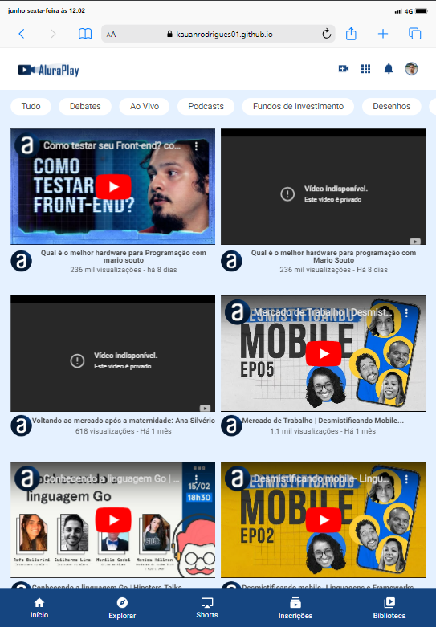
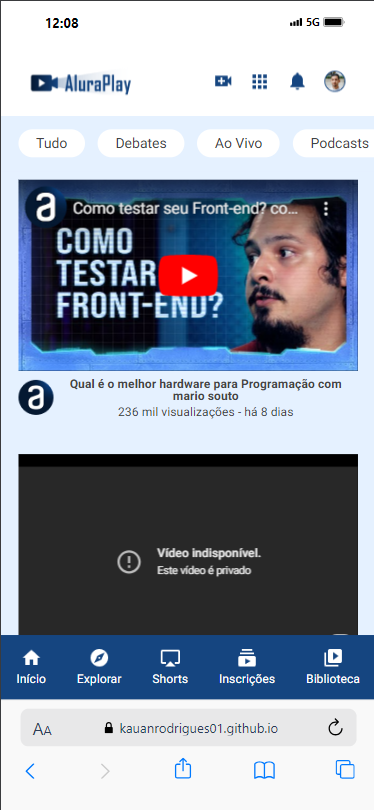

# Flexbox e Layouts Responsivos

Este repositório contém exemplos e explicações sobre o uso do Flexbox para criar layouts responsivos na web. Através de exemplos práticos, você aprenderá a utilizar essa poderosa ferramenta de CSS para construir interfaces flexíveis e adaptáveis a diferentes tamanhos de tela.

---

## 🌐 Visão Geral

O projeto visa demonstrar o poder do Flexbox para criar layouts que se ajustam automaticamente a dispositivos de diferentes tamanhos, proporcionando uma experiência consistente e agradável ao usuário.

---

## 🖥️ Imagens do Projeto

### Desktop

### Tablet

### Mobile

---

## 🛠️ Tecnologias Utilizadas

- **HTML5:** Estrutura básica do site.
- **CSS3 com Flexbox:** Estilização e criação de layouts responsivos.
